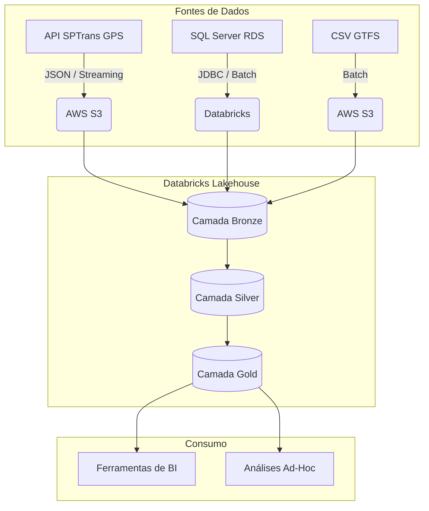

# BrasilFlow: Modern Data Lakehouse

## Visão Geral
O **BrasilFlow** é um pipeline de dados desenvolvido para processar e analisar informações de mobilidade urbana da cidade de São Paulo (SPTrans). O projeto implementa uma arquitetura de *Data Lakehouse* robusta, unificando processamento em tempo real e em lote para fornecer uma fundação analítica escalável.

O pipeline consome posições de GPS de ônibus via streaming, integrando essas informações com dados relacionais operacionais (motoristas, escalas e manutenções) e malhas de transporte (GTFS) para modelagem analítica e suporte à tomada de decisão.

## Arquitetura de Dados

O projeto foi desenhado sob os princípios da **Arquitetura Medallion**, garantindo qualidade, rastreabilidade e performance ao longo do ciclo de vida dos dados.

## Estrutura das Camadas

*   **Camada Bronze (Raw Data):** Ingestão de dados brutos provenientes de fontes heterogêneas. Utiliza processamento em streaming para consumo contínuo da API de GPS e integração via JDBC para a replicação de dados transacionais.
*   **Camada Silver (Cleansed Data):** Camada de integração e qualidade. Os dados passam por processos de limpeza, padronização e validação. Anomalias e registros corrompidos são tratados para assegurar a consistência dos dados que alimentarão as análises.
*   **Camada Gold (Curated Data):** Modelagem dimensional estruturada em *Star Schema* (Tabelas Fato e Dimensões). Os dados são enriquecidos e otimizados para alta performance em consultas analíticas e construção de dashboards corporativos.

## Stack Tecnológico

*   **Cloud Provider:** AWS (Amazon S3, Amazon RDS)
*   **Data Processing Engine:** Databricks, Apache Spark (PySpark)
*   **Armazenamento Analítico:** Delta Lake
*   **Modelagem e Transformação:** SQL, Python
*   **Orquestração de Pipelines:** Databricks Workflows
*   **Governança de Dados:** Unity Catalog
